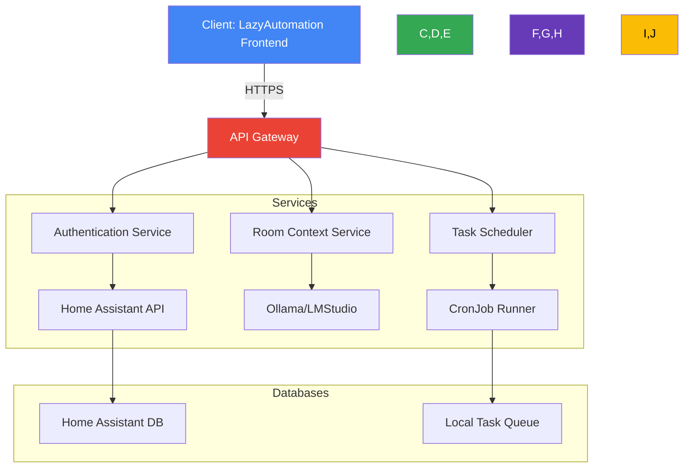

# Architecture Overview

## High-Level Diagram

## Service Dependencies
1. **API Gateway**: 
   - Exposes all endpoints with HTTPS.
   - Uses `${HAS_TOKEN}` for authentication to Home Assistant API.
   - Routes requests to appropriate services based on the endpoint.

2. **Room Context Service**:
   - Fetches sensor data from Home Assistant using `${REACT_APP_HASS_HOST}`.
   - Integrates with Ollama (`${REACT_APP_OLLAMA_HOST}`) and LMStudio (`${LMSTUDIO_HOST}`) for AI-based context analysis.

3. **Task Scheduler**:
   - Executes cron jobs using `${CRON_SCHEDULE}`.
   - Uses environment variables to pass configuration, such as `LLM_API_KEY` or `OPENCODE_API_KEY`.

4. **External Services**:
   - Home Assistant API: Secure connection over HTTPS only.
   - LLM Provider: Connects via `${REACT_APP_LLM_API_URL}`.
   - OpenCode Runner: Authenticated with `${OPENCODE_API_KEY}`.